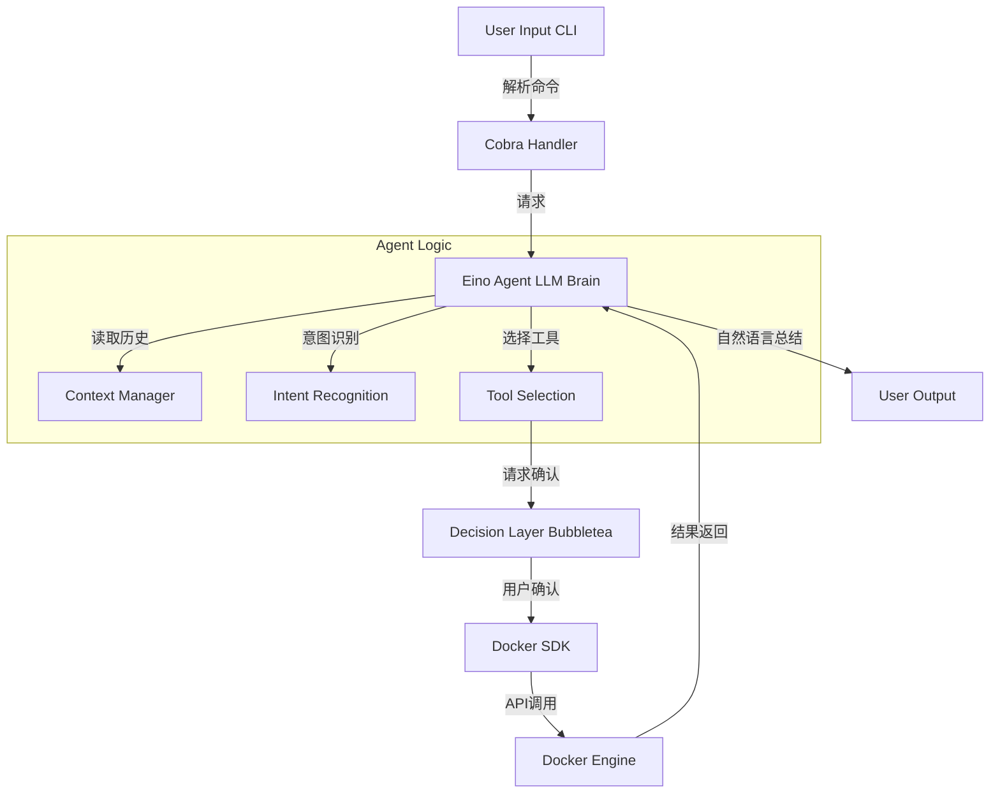
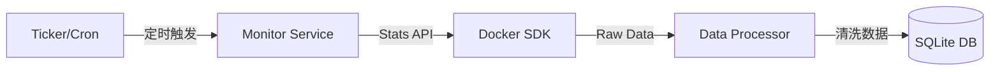
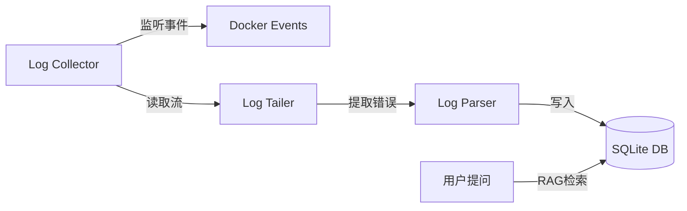

# CentAgent 技术架构设计方案

本文档基于 `WiN.md` 需求，详细阐述了基于 Eino 和 Docker 的智能化 Agent 管理工具的技术实现方案。

## 1. 详细技术栈 (Technical Stack)

为了实现高性能、易维护且交互友好的 CLI 工具，采用以下 Go 生态中的主流技术栈：

*   **核心语言**: `Go` (Golang)
    *   兼具高性能与并发优势，天然适合开发 CLI 和系统级工具。
*   **Agent 框架 (核心)**: `github.com/cloudwego/eino`
    *   **用途**: 利用 Eino 提供的 `Graph` 或 `Chain` 编排能力，构建 ReAct (Reasoning + Acting) 智能体。
    *   **职责**: 负责意图识别、工具调用（Docker 操作）、上下文管理。
    *   **优势**: 字节跳动开源，原生 Go 实现，类型安全，易于扩展 Tool 接口。
*   **命令行接口 (CLI)**: `github.com/spf13/cobra`
    *   **用途**: 处理命令参数解析（如 `centagent start`, `centagent chat`），提供标准的 CLI 体验。
*   **终端交互 (TUI)**: `github.com/charmbracelet/bubbletea` + `huh`
    *   **用途**: 构建现代化的终端界面。
    *   **场景**: 展示动态加载动画、格式化的表格（容器列表）、以及**用户决策确认**（Yes/No 表单）。
*   **容器运行时交互**: `github.com/docker/docker/client` (Official SDK)
    *   **用途**: 直接与 Docker Engine API 通信，执行 CRUD 操作。
*   **数据持久化 (存储)**: `SQLite` + `GORM` (`gorm.io/gorm`)
    *   **用途**: 本地轻量级数据库，单文件部署，无需额外安装服务。
    *   **存储内容**:
        *   容器状态历史（用于生成时序图表或回答“昨天 redis 挂了几次”）。
        *   容器关键日志片段。
        *   操作审计记录（Agent 执行了什么操作）。
*   **定时任务/调度**: `Go Ticker` 或 `github.com/robfig/cron`
    *   **用途**: 后台协程定期采集 Docker 状态和指标。

---

## 2. 用户交互设计 (User Interaction Design)

基于 "Task 1 & 2" (接收指令 & 用户决断)，设计如下交互流程：

### 模式 A: 交互式对话模式 (Chat Mode)
用户输入 `centagent chat` 进入沉浸式会话。

1.  **用户输入**: "帮我检查一下为什么 my-nginx 跑得这么慢？"
2.  **Agent 思考 (Loading)**: 界面显示 `Thinking...` 动画。
    *   Agent 识别意图 -> 调用 `GetContainerStats` 工具。
    *   Agent 分析数据 -> 发现 CPU 占用 99%。
3.  **Agent 反馈与建议**:
    *   输出: "检测到 `my-nginx` CPU 使用率高达 99%。可能是流量突增或死循环。"
    *   **用户决断 (Feature 1-Task 2)**:
        > "建议重启容器以尝试恢复。是否执行？"
        > [ 立即重启 ]  [ 查看最近日志 ]  [ 暂不处理 ] (使用方向键选择)
4.  **执行反馈**: 用户选择“立即重启” -> 显示执行进度条 -> 输出“重启成功”。

### 模式 B: 单次指令模式 (Command Mode)
用户直接执行 `centagent analyze --container redis`。
*   适合脚本集成或快速查询，直接输出分析报告。

---

## 3. 数据流设计 (Data Flow Design)

系统主要包含三条核心数据流：

### (1) 指令执行流 (Command Execution Flow)

### (2) 状态监控流 (Monitoring Flow) - *后台协程*

*   *设计要点*: 监控流与主交互流解耦，确保监控不阻塞用户操作。

### (3) 日志收集与分析流 (Log Collection & Analysis Flow)

---

## 4. 性能优化建议 (Performance Optimization)

针对 Feature 3 & 4 (监控与日志)，采取以下策略：

1.  **Docker 连接复用 (Connection Pooling)**:
    *   不要每次操作都创建 `client.NewClientWithOpts`。在应用启动时初始化一个全局单例 Docker Client，复用 TCP/Unix Socket 连接。
2.  **日志流式处理 (Stream Processing)**:
    *   **避免**: 一次性加载整个日志文件到内存。
    *   **建议**: 使用 `stdcopy.StdCopy` 结合 `io.Pipe` 进行流式读取。对于持久化，只存储最近 N 条或通过关键词过滤（如只存包含 "Error" 的行），避免 SQLite 膨胀。
3.  **异步非阻塞 (Async Non-blocking)**:
    *   监控采集必须在独立的 Goroutine 中运行。
    *   用户输入时，Agent 的思考过程应异步进行，并通过 Channel 更新 TUI 状态，防止界面假死。
4.  **本地缓存与索引 (Local Cache & Indexing)**:
    *   SQLite 中对 `container_id`, `timestamp` 字段建立索引，加速 `Feature 1-task3` 的历史记录查询速度。
    *   缓存常用的 Docker 静态信息（如 Image 列表），减少对 Docker Daemon 的频繁 IPC 调用。
5.  **Context 窗口管理**:
    *   Eino 维护对话历史时，设置滑动窗口（如只保留最近 10 轮对话），或使用 Summary 机制总结旧对话，防止 Token 消耗过大且拖慢 LLM 响应速度。
